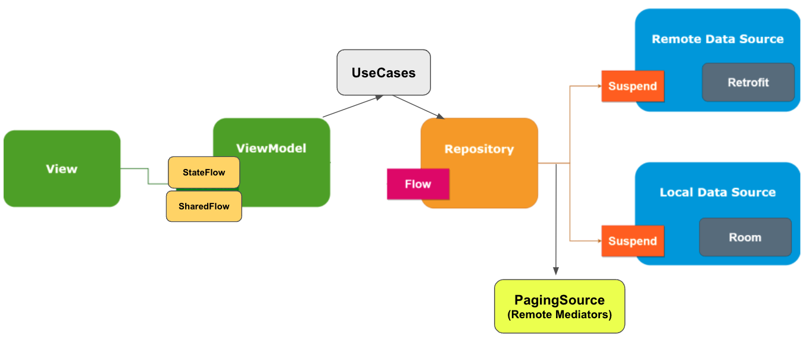

# Welcome to Android RappiPay Tech Test!

### 1. ¿En qué consiste el principio de responsabilidad única? ¿Cuál es su propósito?


El principio de responsabilidad única hace parte de los principios SOLID, 
en donde se especifica que clases y métodos deben tener solamente una responsabilidad; y las otras instrucciones que estos deban ejecutar/realizar, 
se deben delegar a otros métodos y clases. 

Por ejemplo en este proyecto, teniendo en cuenta la clase CustomToolbar, debe existir solamente las instrucciones que 
definen las caracteristicas y comportamiento de dicho toolbar; por lo tanto, allí no debe existir lógica de negocio o implementaciones de otros componentes.

Su propósito es facilitar el proceso de desarrollo y entendimiento del proyecto, ya que no se mezclarán comportamientos que puedan aumentar la complejidad y el acoplamiento del código.

### 2. ¿Qué características tiene, según su opinión, un “buen” código o código limpio?


Un proyecto que contenga código limpio es:

- Organizado, se tiene clara su estructura de módulos, directorios, clases.
- Posee una arquitectura definida, además de patrones de diseño que aumentan la claridad del código. 
- Su código es autodocumentado (no se necesita de comentarios extra para entender el propósito de las instrucciones codificadas).
- Posee estándares de estilo, tales como la indentación y el espaciado.
- Hace uso de versiones recientes de las bibliotecas y dependencias integradas en el proyecto.
- Posee unit testing en los puntos críticos e importantes del sistema. 
- Otras personas pueden entender, añadir y modificar código con facilidad. 
- No contiene código repetido ni código que no se está usando.
- Está mantenido por analizadores de código estático y linters.
- Posee documentación en los sitios más importantes del sistema. 

### 3. Detalla cómo harías todo aquello que no hayas llegado a completar. 


- Analizar memory leaks, revisando los resultados y logs que arroja la biblioteca CanaryLeaks
- Implementar instrumented tests usando espresso, además de implementar unit tests para los view model. 
- Implementar la biblioteca Jacoco para medir y tener control sobre el coverage de las pruebas unitarias implementadas
- Implementar SonarCloud para analizar la calidad del código.
- Usar la app Test de Accesibilidad para analizar la app y ajustar según sea necesario.
- Obtener la base url de descarga de las imágenes de forma dinámica, a traves del endpoint /configuration.
- Si la información de los endpoints de movies varía, implementar un background service usando WorkManager para actualizar caché.
- Mostrar un layout específico para el caso de que los filtros seleccionados no posean movies asociadas (no hay resultados para los filtros seleccionados). 
- Mostrar un layout específico para cuando el dispositivo no tenga conexión a internet, así se retroalimenta al usuario y se le da la opción de recargar la información.

## What's included

An Android app with _modular architecture_, clean architecture, SOLID principles and _MVVM_.



Furthermore, some libraries and frameworks such as:

* _Splash screen api_ and container _HomeActivity_.
* _Network connectivity interceptor_ for HTTP requests.
* _Hilt_ for dependencies injection.
* _Room_ for local storage.
* _Navigation Component_ as app navigation framework.
* _Coil_ for loading and caching images.
* _Retrofit2_ for API requests.
* _Paging3_ for local & remote data pagination.
* _PagingSource_ for pagination orchestration.
* _Coroutines_ and _Flow_ for Reactive Functional Programming.
* _StateFlow_ and _SharedFlow_ for observing and updating data.
* _ViewBinding_ for activities and fragments.
* _Timber_ for debug logging purposes.
* Android Studio _EditorConfig_ file to maintain consistent coding styles.
* Gradle’s Kotlin _DSL_.
* _ktlint_ for static code analysis.
* _LeakCanary_ for memory leaks detection.
* _jUnit_, _MockK_ and _Turbine_ for unit testing.
* _dokka_ for Kotlin's documentation generation.

## Installation

Clone this repository and import it into **Android Studio**

```bash  
git clone https://github.com/JorgeDiazz/android-rappipay-tech-test.git
```  

## Build variants

Herein you can find multiple targets that the app takes into account:

|          |Staging    |Production  |
|----------|-----------|------------|  
|`Internal`|Debug      |Debug       |
|`External`|Release     |Release    |

Where the following formed variants are built for staging purposes:

- stagingInternalDebug
- stagingInternalRelease

And these ones for production purposes:

- productionInternalDebug
- productionInternalRelease
- productionExternalDebug
- productionExternalRelease

**_Sidenote:_** choose productionExternalDebug before executing the app

## Debug app signing

In order to sign your debug app build using _debug-keystore.jks_ keystore, these are the credentials you will have to take in mind:

`STORE_FILE = ./app/debug-keystore.jks`

`STORE_PASSWORD = android`

`KEY_ALIAS = android_rappipay`

`KEY_PASSWORD = android`

## Others

1. Project's CodeStyle can be found [here](docs/codestyle.md).
2. Project utilities file can be found [here](docs/utilities.md).

## Using the app

### Launching the app


### Upcoming movies supporting pagination


### Top rated movies supporting pagination


### Suggested movies recycler view uses top rated cached movies to get updates in real-time


### Filters are populated in real-time as per current top rated cached movies


### Selecting several filters


### Movie Details Screen


### Watching Movie's trailer


### Launching the app using airplane mode (offline mode)


### Retrying movies fetching when Internet connection recovered


### Movie Details Screen (offline mode)


### Persisting screen state (selected filters) in landscape mode 


### Movie Details Screen in landscape mode

